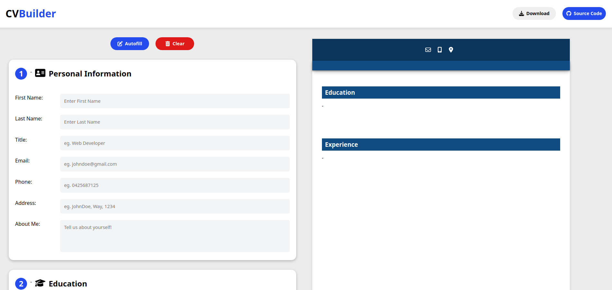
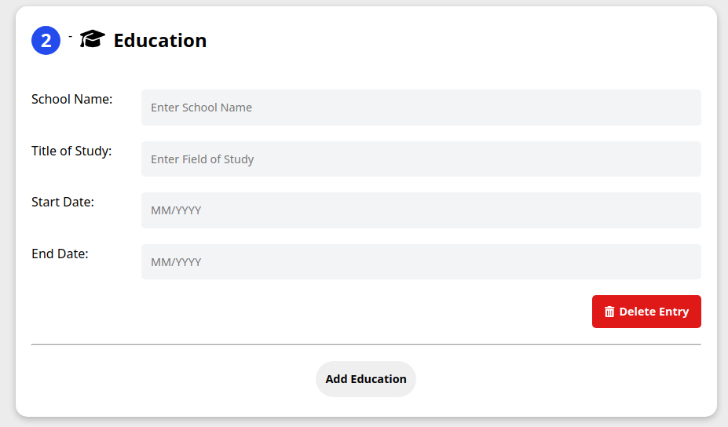
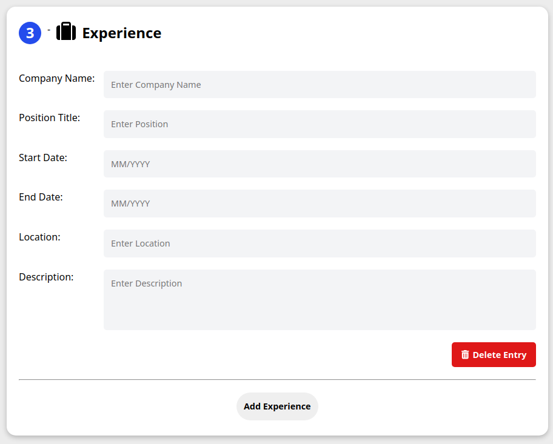
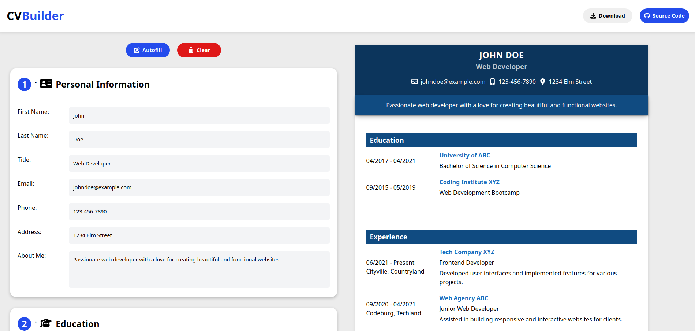

# CV Application

🔗 [View Demo](https://brayden-cv-builder.netlify.app/)

## Table of Contents
- [About The Project](#about-the-project)
- [Built With](#built-with)
- [Screenshots](#screenshots)
- [Features](#features)

## About The Project
A simple and user-friendly CV application that allows you to build your resume.

## Screenshots

### Initial Screen

### Education & Experience Section

### Autofill & CV Preview

[Back to Top](#cv-application)

## Built With

[Back to Top](#cv-application)

## Features

- Live Preview of CV 
- Personal Information, Education & Experience Sections
- Ability to Add Multiple Education & Experience
- Delete Entries
- Autofill & Clear CV
- Download CV in PDF Format
- Mobile Responsive

[Back to Top](#cv-application)
